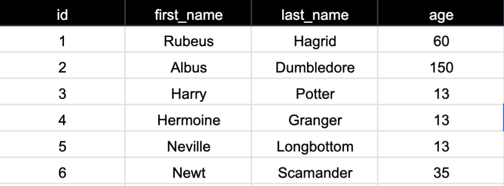

## CSV Exploration

### Introduction

Think back to your first two projects. How have you currently been making instances of objects in those projects? Likely you have been creating an instance of the objects you need in the `runner` file or having the user input information that was then used to create the object. What if there was a larger set of data that you wanted to use to create objects?

### Using files to create objects

Sometimes the data that we want to use will be stored in a CSV. CSV is a file type that stands for _comma separated values_. The information within these files can be organized in columns and rows and might look like this:

The first row is the headers for each column which gives us information about the values in the rows below. Each row we can think of as being a package of information that belongs together. Looking at our example we should see the first package of information is `1, Rubeus, Hagrid, 60`. We know that `1` is the id, `Rubeus` is the first name, `Hagrid` is the last name and `60` is the age because of the header for each column in which the information is located.

Rows and columns are nice for us to visually organize information, but what if we want to use that information in our application? Ruby has helped us by having a defined class called CSV. This class contains methods that we can use to interact with a file.

### Challenge

Fork and clone [this repo](https://github.com/turingschool-examples/csv_example).

For the next 30 minutes, read and use the ruby docs for CSV found [here](https://ruby-doc.org/stdlib-2.6.5/libdoc/csv/rdoc/CSV.html#method-c-new). Within the `runner.rb` file write some code that will print each row from `animal_lovers.csv` to the terminal. If you've been able to print each row, now see if you can also print the header with the value for each row.

_The docs may not be the easiest to read, but do start there to gather information and get some practice reading documentation. After you've looked through the documentation, you can also google for additional resources to help you._

### Sharing is Caring

Let's all come back together and as group look at a few volunteers' soulution.

 _If you've tried the docs and have googled additional resources and you are not making any progress try this_

Last Resort

 
[Turing CSV walkthrough](./csv_walktrhough)

