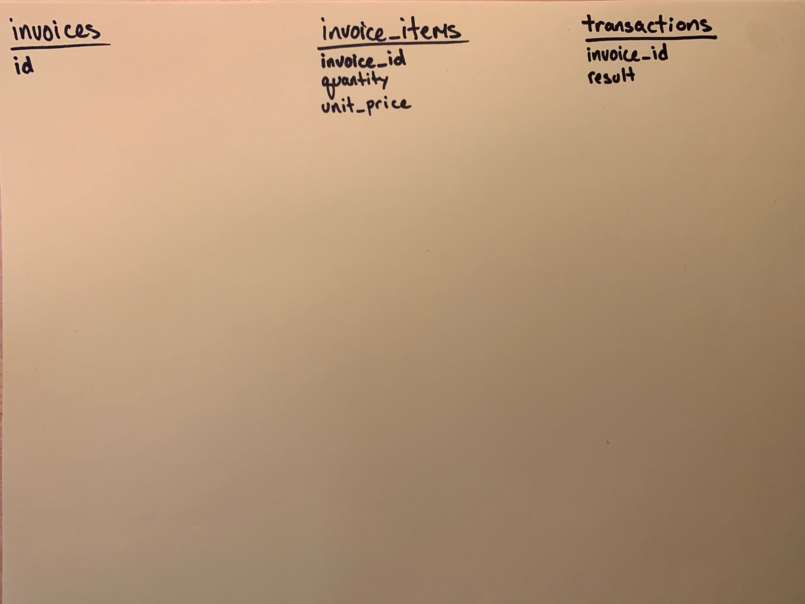
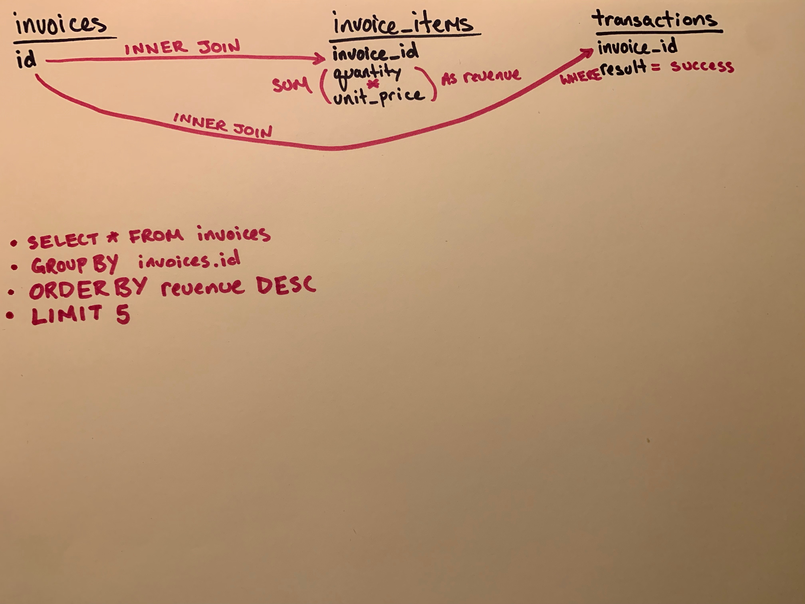
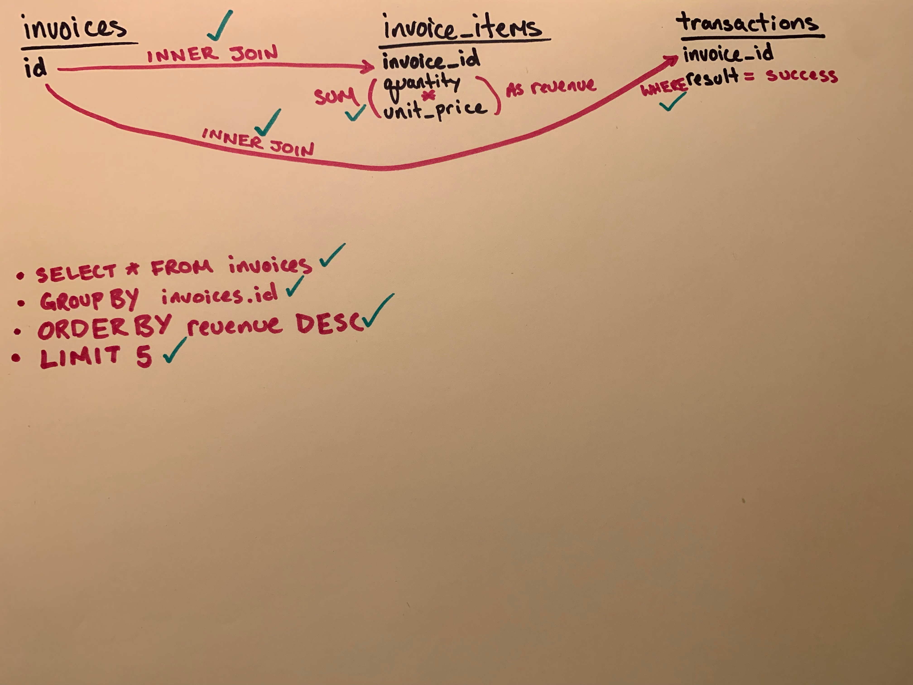

## Learning Goals

* Students can diagram database relationships.
* Students can identify the tables in a database that hold information required to complete complex queries.
* Students can generate complex ActiveRecord queries using joins, group, order, select, and merge.
* Students can use the rails dbconsole  and rails console to generate ActiveRecord queries.

## Resources

* [Video](https://www.youtube.com/watch?v=OccKyvGvLKE&t=1329s) from a past class and the core ideas

## Objective

```
Find the 5 most expensive invoices with successful transactions.
```

## Warmup (5 mins)

* What tables would we need to query?
* What information would we need from each table?
* What calculations would we need to perform?
* What SQL would we be able to use to create a table with this information?

## Lecture

*WARNING:* This lesson is most beneficial if students don't follow along in class. Students should be called on throughout the lesson to build a solution as an entire group. If students follow along with the lesson plan they will have the answers to the questions and won't learn as much. Guessing is important even if the guess is wrong. The intent of having this lesson plan public is for students to be able to reference it after the class or for those that miss the class.

### Creating a Visual Representation

How many of you have attempted to build a complex ActiveRecord query by throwing spaghetti at the wall? Eventually something will stick. But there's a better way.

As you start to dive into more difficult problems, problems that have many moving parts, it will become more and more difficult to hold all of the relevant information in your head. Another common issue is starting with a clear goal but slowly drifting and building the wrong thing. Starting with a clear goal and a plan will increase the likelihood of you hitting your target in a timely fashion.

There are official ways of diagramming SQL queries but we're going to do something a little different. This technique isn't an official technique so feel free to tweak or find something that works for you. If you're interested in diving deeper into a more official strategy check out this blog post on [Introductory SQL Diagramming](http://www.davidclement.org/tipsntrx/tnt10.6.html).

Let's start by first sketching out all of the columns we need and which table we can find them.

*Instructor Note:* Give students some time to sketch things out on their own before doing this as a group. Once they appear to be done call on students to mention the columns we will need to use. When finished it should look something like this:



Next up, let's make a note about all of the things we think need to happen with each of these columns.

*Instructor Note:* Maybe call on individual students to pick a thing to make note of on the diagram. Having the students drive what is added to the diagram seems to create engagement. When it's all done it should look something like this:



### Converting to ActiveRecord

As we work through the next section we should update the diagram if our understanding changes or if we successfully accomplish one of our goals. We can do something simple like adding a checkmark when we successfully account for each item we documented. When complete we could have a board that looks like this:



To start through this process let's fire up a Rails console. We'll start by building our query slowly, piece by piece. People often struggle with where to start. When we are writing a query that needs to return specific rows, invoices in this case, we should _start by writing our query from the Model representing those rows_. Sometimes, there will be a temptation to start with a join table since they are similar to a hub with spokes that branch out to the tables we need. Avoid this temptation. This will usually result in needing to make more queries than is necessary.

The next thing that is usually good to try is to tack on the easiest portions of the query first and read the output in the console to make sure it matches our expectations. One way to make this easier to read is to use the `.to_sql` method.

```
irb(main)> puts Invoice.joins(:invoice_items).to_sql
```

We added the `puts` to make it easier to read which remove escape characters.

The output should look something like this:

```sql
SELECT "invoices".* FROM "invoices" INNER JOIN "invoice_items" ON "invoice_items"."invoice_id" = "invoices"."id"
```

This looks the way we would expect. Another great tool to use as we're trying to solve these issues is the `rails db` command line tool which will connect us to the database specified in our `database.yml` file. Let's fire that up in another tab in our terminal. It's worth noting that this is going to have access to any SQL commands in a similar way to using something like `psql` but it does not have access to the Rails environment so we won't be able to write an Ruby. This can be a nice place to run your queries and have a table based representation of the output. This can be especially handy when you start adding aliases and things like that. If we paste that query, add on a semi-colon, and run it we should see something like this.

```sql
rales_engine_development=# SELECT "invoices".* FROM "invoices" INNER JOIN "invoice_items" ON "invoice_items"."invoice_id" = "invoices"."id";
  id  | customer_id | merchant_id | status  |     created_at      |     updated_at
------+-------------+-------------+---------+---------------------+---------------------
    1 |           1 |          26 | shipped | 2012-03-25 09:54:09 | 2012-03-25 09:54:09
    1 |           1 |          26 | shipped | 2012-03-25 09:54:09 | 2012-03-25 09:54:09
    1 |           1 |          26 | shipped | 2012-03-25 09:54:09 | 2012-03-25 09:54:09
    1 |           1 |          26 | shipped | 2012-03-25 09:54:09 | 2012-03-25 09:54:09
    1 |           1 |          26 | shipped | 2012-03-25 09:54:09 | 2012-03-25 09:54:09
    1 |           1 |          26 | shipped | 2012-03-25 09:54:09 | 2012-03-25 09:54:09
    1 |           1 |          26 | shipped | 2012-03-25 09:54:09 | 2012-03-25 09:54:09
    1 |           1 |          26 | shipped | 2012-03-25 09:54:09 | 2012-03-25 09:54:09
    2 |           1 |          75 | shipped | 2012-03-12 05:54:09 | 2012-03-12 05:54:09
```

It's important to make sure we are seeing what we would expect. Why do we see multiples of the same record?

This looks the way that we would expect. Mark it off on the diagram. Then, let's get to the next part of the query.

```sql
Invoice.joins(:invoice_items, :transactions)
```

1. Confirm the SQL looks the way it should.
2. Mark it off on our diagram.


## Workshop (Usually in the afternoon)

* Divide students into groups of four-ish.
* Have each group pick a business intelligence problem to work on. Preferably, each group will pick a different problem.
* Each group should practice what we demonstrated in the morning class:
  * Diagram their understanding of the problem. Include SQL functions and required columns.
  * Include SQL functions, techniques, and aggregate functions.
  * Have students include their names on their diagram for other students to reach out for help when they get to the same problem.
* After diagramming is complete, each student should work independently near their group and ask for help when they get stuck.
* If a student finishes early, have them pair with one of their partners or bounce around to help.
* With the last 5 minutes of the session have the students walk around the room and review the different diagrams. Keep these diagrams up for the rest of the week.
