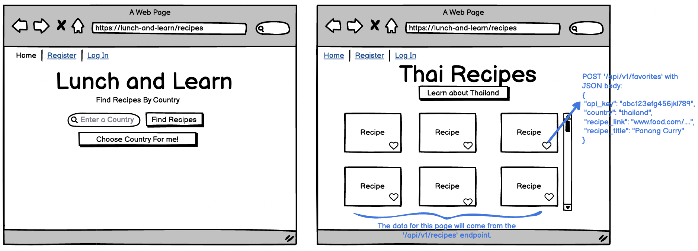
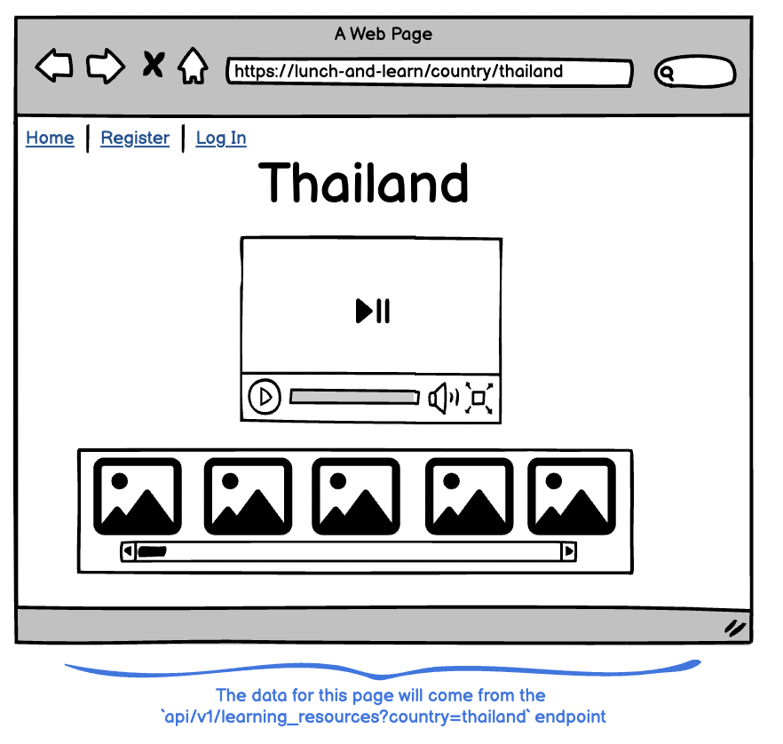
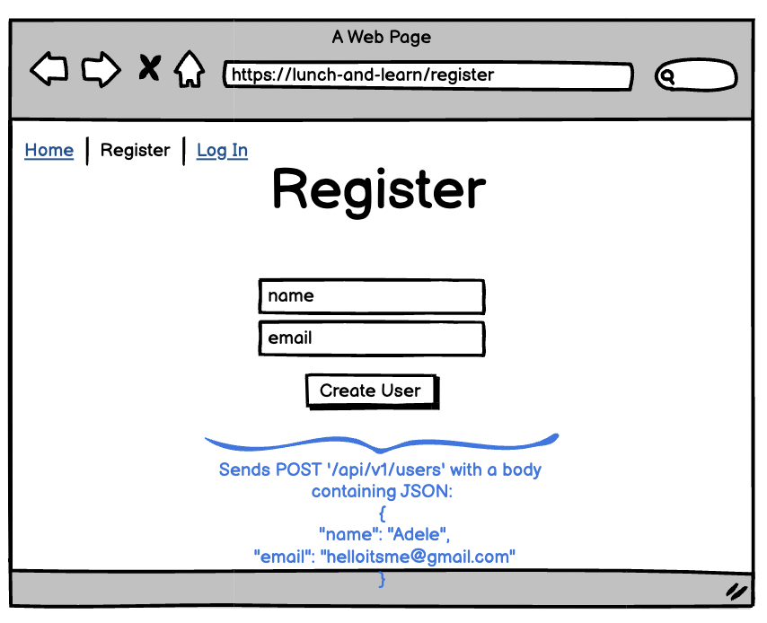
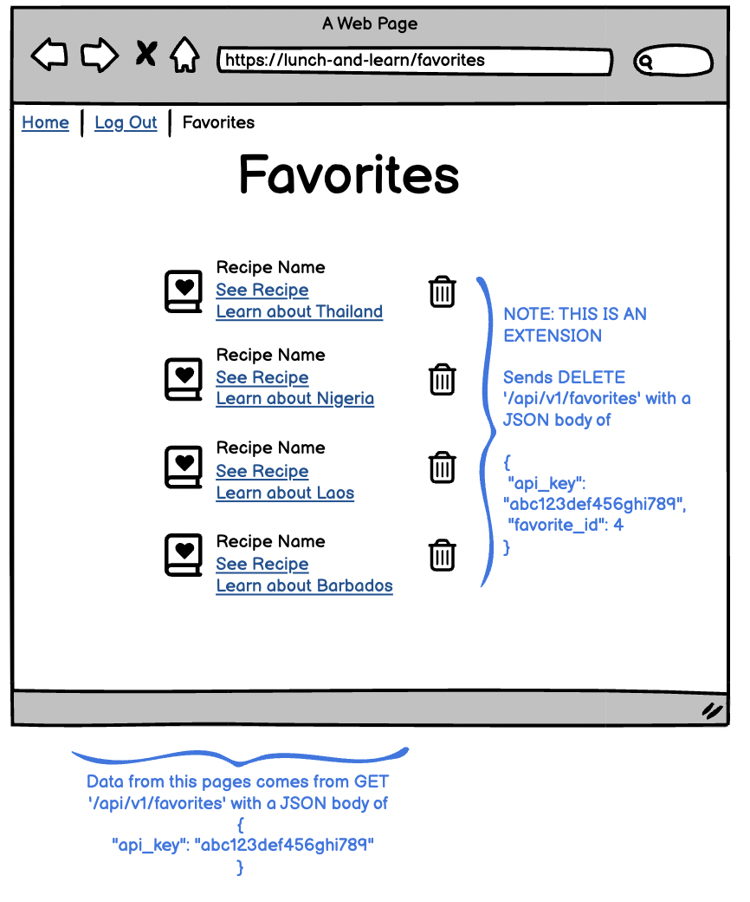

# Important Note about Getting Started

1. This project is an API based application. __Use__ the `rails new --api and other flags` when creating your application. _Doing `rails new` which includes views, etc is NOT a correct project structure._

2. We would like to see a README file included in your project that outlines the learning goals, how someone can clone and set up your application and where they can get their own API keys, and happy path endpoint use.

3. It is __optional__ to use a gem for serializing.


## 1. Get Recipes For A Particular Country

The front-end team has drawn up these wireframe for the application's functionality of searching for cuisines by country:



They need your API to expose one API endpoint in order to populate this page with the necessary data.

---

**Request:**

```
GET /api/v1/recipes?country=thailand
Content-Type: application/json
Accept: application/json
```

**Response:**

The response data should contain exactly these elements and nothing more:

- a data attribute, under which all other attributes are present:
    - collection, each containing the following:
        - id, always set to null
        - type, always set to recipe
        - attributes, containing the following:
            - title
            - url
            - country used for search
            - image url

Example:
```json
{
    "data": [
        {
            "id": null,
            "type": "recipe",
            "attributes": {
                "title": "Andy Ricker's Naam Cheuam Naam Taan Piip (Palm Sugar Simple Syrup)",
                "url": "https://www.seriouseats.com/recipes/2013/11/andy-rickers-naam-cheuam-naam-taan-piip-palm-sugar-simple-syrup.html",
                "country": "thailand",
                "image": "https://edamam-product-images.s3.amazonaws.com..."
            }
        },
        {
            "id": null,
            "type": "recipe",
            "attributes": {
                "title": "Sriracha",
                "url": "http://www.jamieoliver.com/recipes/vegetables-recipes/sriracha/",
                "country": "thailand",
                "image": "https://edamam-product-images.s3.amazonaws.com/."
            }
        },
        {...},
        {...},
        {...},
        {etc},
    ]
}
```


**Requirements:**

* If country is not sent in by the user, you will need to use the [REST Countries API](https://restcountries.com/#api-endpoints-v3-all) to randomly choose one country's name.
* For whichever country is either passed in or chosen at random, find recipes using the [Edamam Recipe API](https://developer.edamam.com/edamam-recipe-api)
    - Note: use the `q` parameter to search for recipes related to that country
* If the country parameter is passed in, but it is an empty string, respond with an appropriate [400-level status code](https://en.wikipedia.org/wiki/List_of_HTTP_status_codes#4xx_Client_errors) and a descriptive error message.
* Testing should look for more than just the presence of attribute fields in the response. Testing should also determine which fields should NOT be present. (don't send back unnecessary data in the response)


---

## 2. Get Learning Resources for a Particular Country

The front-end team has drawn up this wireframe for their country show page.



They need your API to expose one API endpoint in order to populate this page with the necessary data. 

---

**Request:**

```
GET /api/v1/learning_resources?country=thailand
Content-Type: application/json
Accept: application/json
```

**Response:**

The response data should contain exactly these elements and nothing more:

- a data attribute, under which all other attributes are present:
  - id, always set to null
  - type, set to "learning_resource"
  - attributes, under which the following is present:
    - country name
    - video, an object containing:
        - title of video 
        - video id from youtube
    - images, a collection holding elements that have information about that image, for example:
        - alternative description (for alt tags)
        - url for image

Example:
```json
{
    "data": {
        "id": null,
        "type": "learning_resource",
        "attributes": {
            "country": "thailand",
            "video": {
                "title": "A Super Quick History of Laos",
                "youtube_video_id": "uw8hjVqxMXw"
            },
            "images": [
                {
                    "alt_tag": "standing statue and temples landmark during daytime",
                    "url": "https://images.unsplash.com/photo-1528181304800-259b08848526?ixid=MnwzNzg2NzV8MHwxfHNlYXJjaHwxfHx0aGFpbGFuZHxlbnwwfHx8fDE2Njc4Njk1NTA&ixlib=rb-4.0.3"
                },
                {
                    "alt_tag": "five brown wooden boats",
                    "url": "https://images.unsplash.com/photo-1552465011-b4e21bf6e79a?ixid=MnwzNzg2NzV8MHwxfHNlYXJjaHwyfHx0aGFpbGFuZHxlbnwwfHx8fDE2Njc4Njk1NTA&ixlib=rb-4.0.3"
                },
                {
                    "alt_tag": "orange temples during daytime",
                    "url": "https://images.unsplash.com/photo-1563492065599-3520f775eeed?ixid=MnwzNzg2NzV8MHwxfHNlYXJjaHwzfHx0aGFpbGFuZHxlbnwwfHx8fDE2Njc4Njk1NTA&ixlib=rb-4.0.3"
                },
                {...},
                {...},
                {...},
                {etc},
              ]
        }
    }
}
```

**Requirements:**

* Endpoint needs to use the [video lists](https://developers.google.com/youtube/v3/docs/videos/list) endpoint from the [YouTube API](https://developers.google.com/youtube/v3/getting-started). All videos should be pulled from the [Mr. History YouTube Channel](https://www.youtube.com/channel/UCluQ5yInbeAkkeCndNnUhpw). You only need to return the first match from your search.
    - Note: You'll need to use the `snippet` part to get more data on your search.
* If no videos are found, `video` should point to an empty object.
* Implement a new API service (Unsplash, Pexels, Microsoft Bing Image search, Wikimedia image search, Flickr and more) to use the name of the country to get the URL of up to 10 images for that country search. 


## 3. User Registration

The front-end team has drawn up this wireframe for registration:



Your api should expose this endpoint:

**Request:**

```
POST /api/v1/users
Content-Type: application/json
Accept: application/json

{
  "name": "Beyoncé Knowles"
  "email": "bey@renaissance.com",
}
```

**Response:**

```
status: 201
body:

{
  "data": {
    "type": "user",
    "id": "1",
    "attributes": {
      "email": "bey@renaissance.com",
      "api_key": "jgn983hy48thw9begh98h4539h4"
    }
  }
}
```

**Requirements:**

* This POST endpoint should NOT call your endpoint like `/api/v1/users?name=BEyoncé Knowles&email=bey@renaissance.com`. You must send a **JSON payload** in the **body** of the request
  - in Postman, under the address bar, click on "Body", select "raw", which will show a dropdown that probably says "Text" in it, choose "JSON" from the list
  - this is a **hard requirement** to pass this endpoint!
* A successful request creates a user in your database, and generates a unique api key associated with that user, with a 201 status code. 
* THIS IS NOT REAL AUTHENTICATION -- Real authentication using bcrypt is an extension. The expectations for this endpoint is that upon creation of this user, a randomly generated code should be stored in the database for that user. This code will be used to add favorites to a particular user's favorite list.
* Email addresses must be unique. If a unique email address is not used for registration, an appropriate error message should be returned in the response.

---

## 4. Add Favorites

Functionality to add recipes to a favorited list for a particular user can be done with the following request.

**Request:**

```
POST /api/v1/favorites
Content-Type: application/json
Accept: application/json

{
    "api_key": "jgn983hy48thw9begh98h4539h4",
    "country": "thailand",
    "recipe_link": "https://www.tastingtable.com/.....",
    "recipe_title": "Crab Fried Rice (Khaao Pad Bpu)"
}
```

**Response:**

```
status: 201
body:

{
    "success": "Favorite added successfully"
}
```

**Requirements:**

* This POST endpoint should NOT call your endpoint like `/api/v1/favorites?country=thailand,recipe_link="https://www.tastingtable.com/....."&recipe_title="Crab Fried Rice (Khaao Pad Bpu)"&api_key=jgn983hy48thw9begh98h4539h4p`. You must send a **JSON payload** in the **body** of the request
  - in Postman, under the address bar, click on "Body", select "raw", which will show a dropdown that probably says "Text" in it, choose "JSON" from the list
  - this is a **hard requirement** to pass this endpoint!
* If the `api_key` is invalid (no user with that api key), an appropriate [400-level status code](https://en.wikipedia.org/wiki/List_of_HTTP_status_codes#4xx_Client_errors) should be returned, as well as a message explaining what went wrong.
* If the `api_key` is valid, create a favorite for the user with that api key.
* A successful request creates a Favorite for that user in the database, and returns a 201 status code.
* Your Favorites Table should store `country`, `recipe_link` and `recipe_title`, as well as a foreign key for `user`. (One to many relationship between User and Favorites)

---

## 5. Get a User's Favorites

The front-end team has drawn up this wireframe for registration:



Your api should expose this endpoint:

**Request:**

```
GET /api/v1/favorites
Content-Type: application/json
Accept: application/json

{
    "api_key": "jgn983hy48thw9begh98h4539h4"
}
```

**Response:**

The response data should contain exactly these elements and nothing more:

- a data attribute, under which all other attributes are present:
  - id, from the database
  - type, always set to "favorite"
  - attributes, an object containing favorited book information:
    - recipe title
    - recipe link
    - country
    - created at date/time

```
status: 200
body:

{
    "data": [
        {
            "id": "1",
            "type": "favorite",
            "attributes": {
                "recipe_title": "Recipe: Egyptian Tomato Soup",
                "recipe_link": "http://www.thekitchn.com/recipe-egyptian-tomato-soup-weeknight....",
                "country": "egypt",
                "created_at": "2022-11-02T02:17:54.111Z"
            }
        },
        {
            "id": "2",
            "type": "favorite",
            "attributes": {
                "recipe_title": "Crab Fried Rice (Khaao Pad Bpu)",
                "recipe_link": "https://www.tastingtable.com/.....",
                "country": "thailand",
                "created_at": "2022-11-07T03:44:08.917Z"
            }
        }
    ]
```

**Requirements:**

* Like the previous two endpoints, this `api_key` will be sent in the body of the request.
* If the `api_key` is invalid, an appropriate [400-level status code](https://en.wikipedia.org/wiki/List_of_HTTP_status_codes#4xx_Client_errors) should be returned, as well as a message explaining what went wrong.
* If the `api_key` is valid, this response will return all books that the user has favorited.
* If the user has not favorited any users, the data object should point to an empty array. 


## Extensions

Coming Soon
