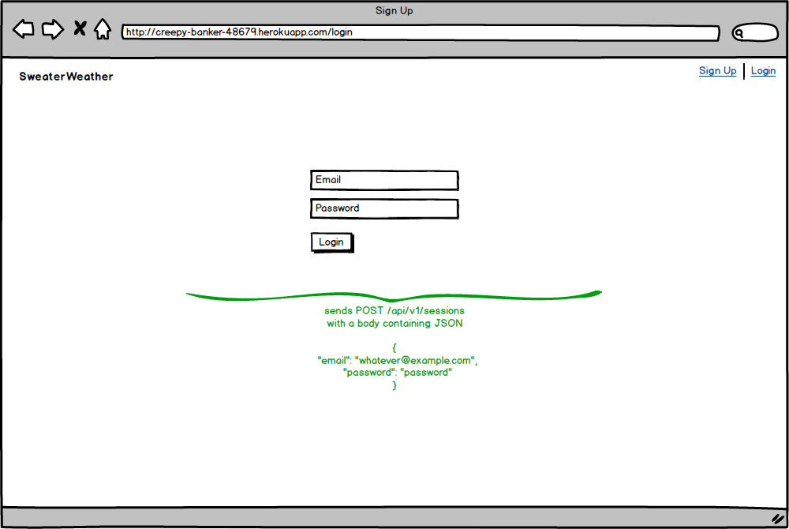

### 1. Weather for a City

The functionality for this page should be split into multiple user stories.

```
GET /api/v1/forecast?location=denver,co
Content-Type: application/json
Accept: application/json
```

**Response:**

There is room for personal preference for this response body. Use the mock ups to see what data is required on the front end to decide what you would like to include in your response. If you'd like more of a challenge, you might consider using [Fast JSON API](https://github.com/Netflix/fast_jsonapi) and consider trying to stick to the [JSON 1.0 spec](https://jsonapi.org/).

**Requirements:**

- Needs to pull out the city and state from the GET request and send it to Google's Geocoding API to retrieve the lat and long for the city (this can be it's own story)
- Retrieve forecast data from the Darksky API using the lat and long


### 1. Part Two - Background Image for a City

```
GET /api/v1/backgrounds?location=denver,co
Content-Type: application/json
Accept: application/json
```
**Response:**

This will search the Flickr API for images associated with the location. This may not return images as intended, you can feel free to add search terms to your query to the Flickr API such as Parks or nature or skyline or whatever in order to return more appropriate images.


### 2. Account Creation

```
POST /api/v1/users
Content-Type: application/json
Accept: application/json

{
  "email": "whatever@example.com",
  "password": "password"
  "password_confirmation": "password"
}
```
**Response:**

```
status: 201
body:

{
  "api_key": "jgn983hy48thw9begh98h4539h4",
}
```


### 3. Login

```
POST /api/v1/sessions
Content-Type: application/json
Accept: application/json

{
  "email": "whatever@example.com",
  "password": "password"
}
```

**Response:**

```
status: 200
body:

{
  "api_key": "jgn983hy48thw9begh98h4539h4",
}
```



### 4. Favoriting Locations

```
POST /api/v1/favorites
Content-Type: application/json
Accept: application/json

body:

{
  "location": "Denver, CO", # If you decide to store cities in your database you can send an id if you prefer
  "api_key": "jgn983hy48thw9begh98h4539h4"
}
```

**Requirements:**

- API key must be sent
- If no API key or an incorrect key is provided return 401 (Unauthorized)

### 5. Listing Favorite Locations

```
GET /api/v1/favorites
Content-Type: application/json
Accept: application/json

body:

{
  "api_key": "jgn983hy48thw9begh98h4539h4"
}
```

**Requirements:**

- API key must be sent
- If no API key or an incorrect key is provided return 401 (Unauthorized)

**Response:**

```
status: 200
body:
[
  {
    "location": "Denver, CO",
    "current_weather": {
      # This can vary but try to keep it consistent with the
      # structure of the response from the /forecast endpoint
    },
    "location": "Golden, CO",
    "current_weather": {
       {...}
    }
  }
]
```

### 6. Removing Favorite Locations

```
DELETE /api/v1/favorites
Content-Type: application/json
Accept: application/json

body:

{
  "location": "Denver, CO", # If you decide to store cities in your database you can send an id if you prefer
  "api_key": "jgn983hy48thw9begh98h4539h4"
}
```

**Requirements:**

- API key must be sent
- If no API key or an incorrect key is provided return 401 (Unauthorized)

**Response:**

```
status: 200
body:
[
  {
    "location": "Denver, CO",
    "current_weather": {
      # This can vary but try to keep it consistent with the
      # structure of the response from the /forecast endpoint
    },
    "location": "Golden, CO",
    "current_weather": {
       {...}
    }
  }
]
```

## Evaluation Rubric

### Feature Delivery

* **1:** Project fell well short of agreed upon expectations. Project not in production.
* **2:** Project completed most user stories set out but fell short of agreed upon expectations. Project is in production.
* **3:** Project completed all the user stories and requirements agreed upon. Project is in production, and a call to an internal API endpoint does not always make an external API call.
* **4:** Project well exceeded expectations. Project is in production, a call to an internal API endpoint does not make an external API call.

### Technical Quality

* **1:**  Project has significant gaps in understanding of MVC with several examples of logic or hashes in the view/presentation layer (e.g. serializers), controllers remain un-refactored, and models are used for formatting.
* **2:**  MVC is overall good but might has 1 or 2 examples of logic or hashes in the view/presentation layer (e.g. serializers), formatting in models, or controllers with complex logic.
* **3:**  Project uses abstraction in ways that make it easy to change (example: if an API changes, Propublica to Google Civic, we make changes in as few places as possible. Or POROs can be used in custom API or in standard views). Project shows a solid understanding of MVC principles (this may include but is not limited to: no logic in view/presentation layer (e.g. serializers), clean controllers, serializers and presenters to handle formatting rather than models etc.) and includes all expectations of numbers 1 and 2 above.
* **4:**  Project meets expectations from number 3 above and takes on at least one new technology outside the required scope. Examples include: background workers, caching in Redis, GraphQL, etc.

### Testing

* **1:** Test suite coverage is low (less than 80%).
* **2:** Test suite coverage is greater than 80% but misses the most meaningful functionality and I would not be happy paying for/inheriting it.
* **3:** Project demonstrates high value testing at different layers (above 90%). If I were inheriting or paying someone to build this app I would be happy with the coverage.
* **4:** Project demonstrates exceptional testing using advanced techniques such as spies. Meets expectations of point 3 above.
