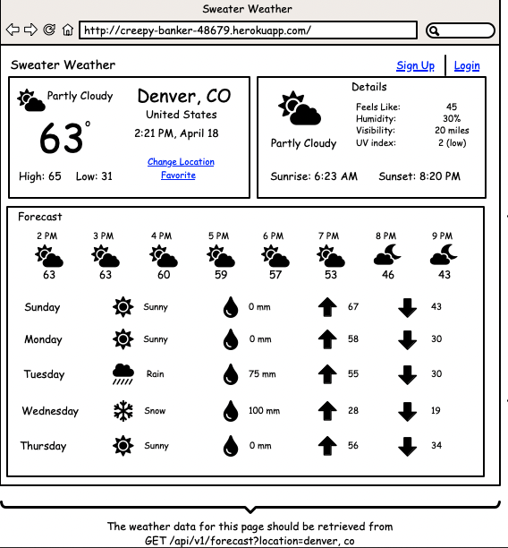

## 1. Application Landing Page

The front-end team has drawn up this wireframe for the application's landing page:



They need your API to expose two endpoints in order to populate this page with the necessary data.

### 1a. Retrieve weather for a city

**Request:**

```
GET /api/v1/forecast?location=denver,co
Content-Type: application/json
Accept: application/json
```

**Response:**

Use the wireframes to see what data is required on the front-end to decide what data should be included in your response. Use the [Fast JSON API](https://github.com/Netflix/fast_jsonapi) and the response should adhere to the [JSON 1.0 spec](https://jsonapi.org/).

**Requirements:**

- Needs to pull out the city and state from the GET request and send it to [MapQuest's Geocoding API](https://developer.mapquest.com/documentation/geocoding-api/) to retrieve the lat and long for the city (this can be its own story). Use of the MapQuest's Geocoding API is a hard requirement.
- Retrieve forecast data from the [OpenWeather One Call API](https://openweathermap.org/api/one-call-api) using the lat and long

### 1b. Background Image for a City

**Request:**

```
GET /api/v1/backgrounds?location=denver,co
Content-Type: application/json
Accept: application/json
```

**Response:**

This will return the url to an appropriate background image for a location.

## 2. Registration

The front-end team has drawn up this wireframe for registration:


Your api should expose this endpoint:

**Request:**

```
POST /api/v1/users
Content-Type: application/json
Accept: application/json

{
  "email": "whatever@example.com",
  "password": "password"
  "password_confirmation": "password"
}
```

**Response:**

```
status: 201
body:

{
  "data": {
    "type": "users",
    "id": "1",
    "attributes": {
      "email": "whatever@example.com",
      "api_key": "jgn983hy48thw9begh98h4539h4"
    }
  }
}
```

**Requirements:**

* A successful request creates a user and generates a unique api key associated with that user.
* An unsuccessful request returns a 400 level status code and body with a description of why the request wasn't successful. Potential reasons a request would fail: passwords don't match, email has already been taken, missing a field, etc.

## 3. Login

The front-end team has drawn up this wireframe for log in:


Your api should expose this endpoint:

**Request:**

```
POST /api/v1/sessions
Content-Type: application/json
Accept: application/json

{
  "email": "whatever@example.com",
  "password": "password"
}
```

**Response:**

```
status: 200
body:

{
  "data": {
    "type": "users",
    "id": "1",
    "attributes": {
      "email": "whatever@example.com",
      "api_key": "jgn983hy48thw9begh98h4539h4"
    }
  }
}
```

**Requirements:**

* A successful request returns the user's api key.
* An unsuccessful request returns a 400 level status code and body with a description of why the request wasn't successful. Potential reasons a request would fail: credentials are bad.

## 4. Road Trip

The front-end team has drawn up these wireframes for a feature where users can plan road trips:


**Request:**

```
POST /api/v1/road_trip
Content-Type: application/json
Accept: application/json

body:

{
  "origin": "Denver,CO",
  "destination": "Pueblo,CO",
  "api_key": "jgn983hy48thw9begh98h4539h4"
}
```

**Response:**

Use the wireframes to see what data is required on the front-end to decide what you would like to include in your response.

**Requirements:**

- API key must be sent
- If no API key or an incorrect key is provided return 401 (Unauthorized)
- You will use MapQuest's Directions API:  `https://developer.mapquest.com/documentation/directions-api/`
- The structure of the response should be JSON API 1.0 Compliant.
