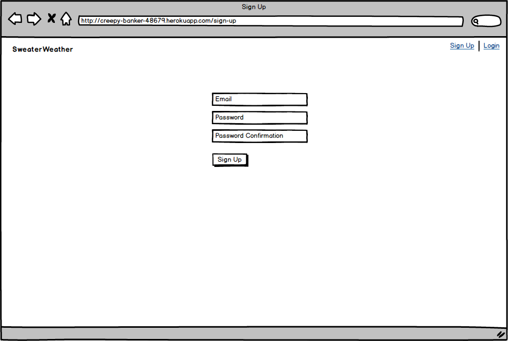
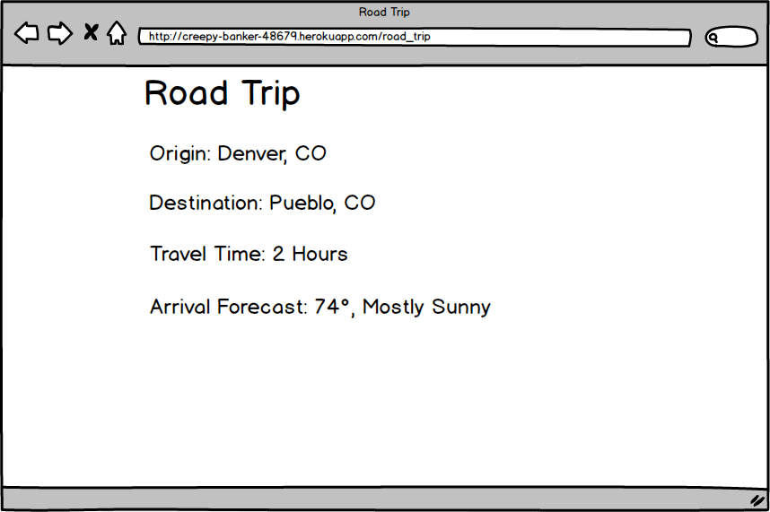

# Important Note about Getting Started

1. This project is an API based application. __Use__ the `rails new --api and other flags` when creating your application. _Doing `rails new` which includes views, etc is not a correct project structure._

2. We would like to see a README file included in your project that outlines the learning goals, how someone can clone and set up your application and where they can get their own API keys, and happy path endpoint use.

3. It is __optional__ to use the [Fast JSON API](https://github.com/Netflix/fast_jsonapi) 


## 1. Application Landing Page

The front-end team has drawn up this wireframe for the application's landing page:


They need your API to expose two API endpoints in order to populate this page with the necessary data.


### 1a. Retrieve weather for a city

**Request:**

```
GET /api/v1/forecast?location=denver,co
Content-Type: application/json
Accept: application/json
```

**Response:**

Use the wireframes to see what data is required on the front-end to decide what data should be included in your response.

**Requirements:**

* Endpoint needs to use the city and state from the GET request and send it to [MapQuest's Geocoding API](https://developer.mapquest.com/documentation/geocoding-api/) to retrieve the latitude and longitude for the city. Use of the MapQuest's Geocoding API is a hard requirement.
* Retrieve forecast data from the [OpenWeather One Call API](https://openweathermap.org/api/one-call-api) using the latitude and longitude from MapQuest.
* Testing should look for more than just the presence of attribute fields in the response. Testing should also determine which fields should NOT be present. (don't send unnecessary data)

### 1b. Background Image for the City

The frontend developers will also call an endpoint to fetch a background image for that page showing the city.

**Request:**

```
GET /api/v1/backgrounds?location=denver,co
Content-Type: application/json
Accept: application/json
```

**Response:**

* This will return the url of an appropriate background image for a location.
* An example of a response COULD look something like this:

```
status: 200
body:

{
  "data": {
    "type": "image",
    "id": null,
    "image": {
      "location": "denver,co",
      "image_url": "https://pixabay.com/get/54e6d4444f50a814f1dc8460962930761c38d6ed534c704c7c2878dd954dc451_640.jpg",
      "credit": {
        "source": "pixabay.com",
        "author": "quinntheislander",
        "logo": "https://pixabay.com/static/img/logo_square.png"
      }
    }
  }
}
```

**Requirements:**

* Implement a new API service (Unsplash, Pexels, Pixabay, Microsoft Bing Image search, Wikimedia image search, Flickr and more) to use the name of the city to get the URL of an appropriate background image.
* Please read the terms of use of your image provider about giving credit for the search results, and put appropriate content in the response!!

**Extension:**

* Determine the time of day and current weather and include that in your search; for example, searching for "denver evening snow" might return a far more interesting result

---

## 2. User Registration

The front-end team has drawn up this wireframe for registration:



Your api should expose this endpoint:

**Request:**

```
POST /api/v1/users
Content-Type: application/json
Accept: application/json

{
  "email": "whatever@example.com",
  "password": "password"
  "password_confirmation": "password"
}
```

**Response:**

```
status: 201
body:

{
  "data": {
    "type": "users",
    "id": "1",
    "attributes": {
      "email": "whatever@example.com",
      "api_key": "jgn983hy48thw9begh98h4539h4"
    }
  }
}
```

**Requirements:**

* This POST endpoint should NOT call your endpoint like `/api/v1/users?email=person@woohoo.com&password=abc123&password_confirmation=abc123`, you must send a JSON payload in the body of the request
* A successful request creates a user and generates a unique api key associated with that user, with a 201 status code. The response should NOT include the password in any way
* An unsuccessful request returns an appropriate [400-level status code](https://en.wikipedia.org/wiki/List_of_HTTP_status_codes#4xx_Client_errors) and body with a description of why the request wasn't successful.
  * Potential reasons a request would fail: passwords don't match, email has already been taken, missing a field, etc.

---

## 3. Login

The front-end team has drawn up this wireframe for log in:


Your api should expose this endpoint:

**Request:**

```
POST /api/v1/sessions
Content-Type: application/json
Accept: application/json

{
  "email": "whatever@example.com",
  "password": "password"
}
```

**Response:**

```
status: 200
body:

{
  "data": {
    "type": "users",
    "id": "1",
    "attributes": {
      "email": "whatever@example.com",
      "api_key": "jgn983hy48thw9begh98h4539h4"
    }
  }
}
```

**Requirements:**

* This POST endpoint should NOT call your endpoint like `/api/v1/sessions?email=person@woohoo.com&password=abc123`, you must send a JSON payload in the body of the request
* A successful request returns the user's api key.
* An unsuccessful request returns an appropriate [400-level status code](https://en.wikipedia.org/wiki/List_of_HTTP_status_codes#4xx_Client_errors) and body with a description of why the request wasn't successful.
  * Try not to send back just a '400' status code, that's too vague
  * Potential reasons a request would fail: credentials are bad.

## 4. Road Trip

The front-end team has drawn up these wireframes for a feature where users can plan road trips:



**Request:**

```
POST /api/v1/road_trip
Content-Type: application/json
Accept: application/json

body:

{
  "origin": "Denver,CO",
  "destination": "Pueblo,CO",
  "api_key": "jgn983hy48thw9begh98h4539h4"
}
```

**Response:**

Use the wireframes to see what data is required on the front-end to decide what you would like to include in your response.

**Requirements:**

* This POST endpoint should NOT call your endpoint like `/api/v1/road_trip?origin=Denver,CO&destination=Pueblo,CO&api_key=abc123`, you must send a JSON payload in the body of the request
- API key must be sent
- If no API key is given, or an incorrect key is provided, return 401 (Unauthorized)
- You will use MapQuest's Directions API:  `https://developer.mapquest.com/documentation/directions-api/`
- The structure of the response should be JSON API 1.0 Compliant.
