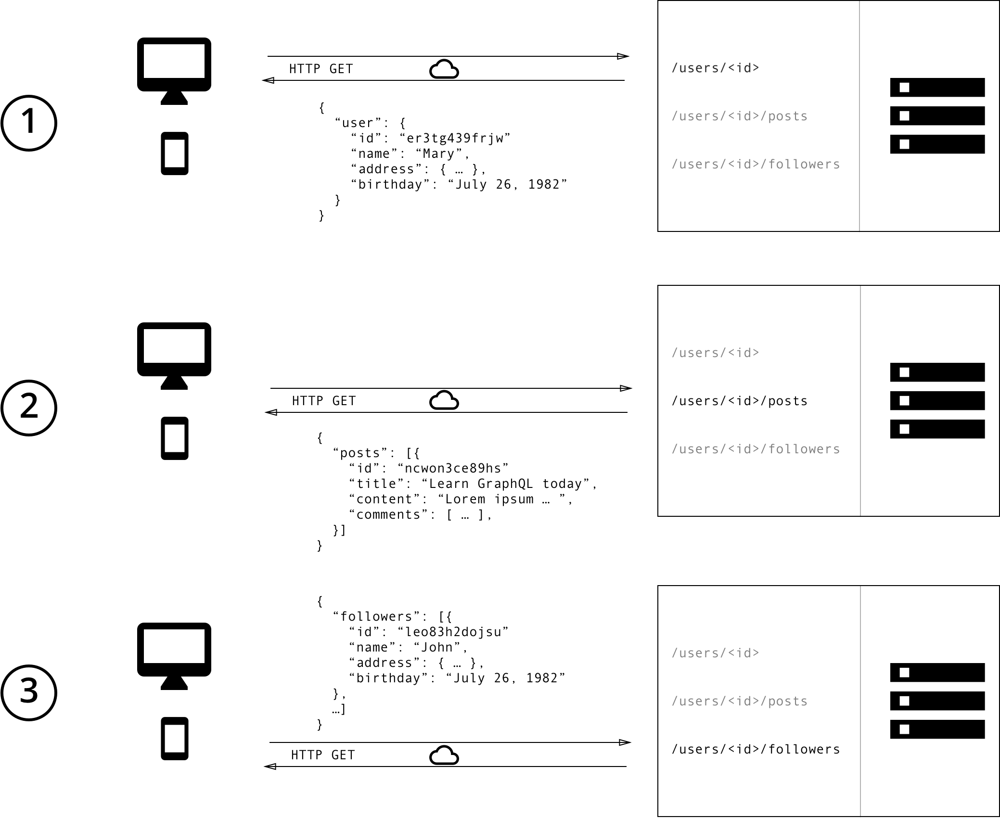
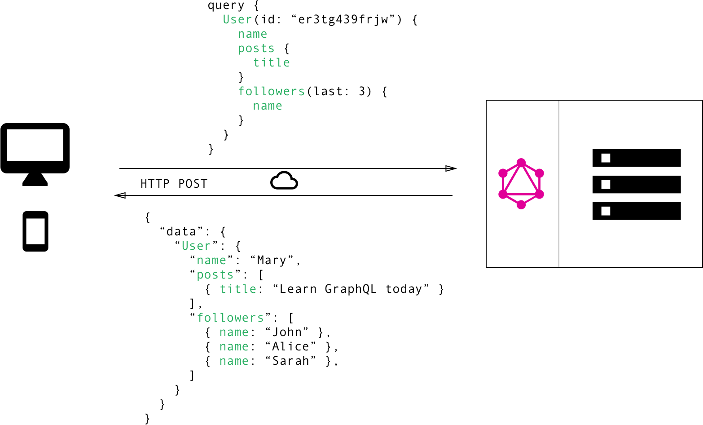
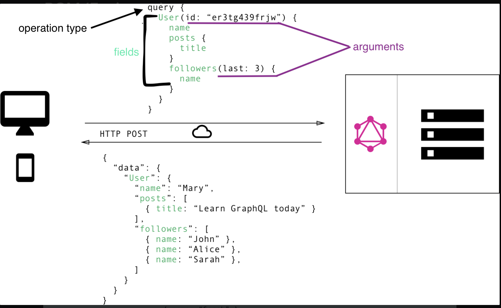

### Vocabulary

- Overfetching
- Underfetching
- n + 1 queries
- Operation
- Field
- Argument

### Warmup

- Why do we use APIs?
- What makes an API RESTful?
- Why do we commonly see `/api/v1/` included in RESTful API endpoints?

### What is GraphQL?

GraphQL is a query language for APIs *not databases*. It's a specification for how clients can query the API for information. Since, it is a specification for interacting with an API, it is database, programming language, and network transport(HTTP, TCP, etc.) agnostic.

## Why does it matter?

### What problems are being solved by GraphQL?

GraphQL was designed to help with performance efficiency and to address under and over fetching.

Imagine that you have a blogging website. After a user has logged in you want to show them a dashboard page. On this page you want to display the logged in user's name, the titles of the blogs they have written, and their top 3 followers.

**Turn & Talk**
- How many API calls would you need to make to retrieve all this information?
- What would each request and the response look like?

1. Diagram of RESTful API Requests and Responses

REST API requests/responses

No one endpoint has all the information that we need for this page. This is known as under fetching. We make an api call, and then need to make an additional call for more information. This also goes along with `n + 1` queries. Where our page may need to first make a call to load elements to get the `id` for a resource and then make an additional request for every element using the `id`.

If we consider the response for each of the endpoints there is extra information that we don't actually need for our page. This is know as over fetching. For instance, if we look at the `get user` response, it might include the `name`, `address`, and `birthday`.  The only information that is needed from this endpoint is the name.

2. Diagram of GraphQL API Request and Response

GraphQL reqeust/response

### Benefits of Using GraphQL

Other than the benefits we mentioned above, it also allows for frontend teams to  have more control over the data they are requesting. For instance, if we wanted to include the user's birthday on our user's dashboard page, we simply need to update our request to retrieve that information. This allows for these changes to be made quickly.

Also, as a backend engineer, there are insights that can be gained from the requests that are being received. Since the frontend is only requesting the specific information that is needed, it can be clearer to see if there are fields that are never being used. Having this information allows backend teams to change the API to be better focused on the needs of its user and deprecate information that is irrelevant.

## Components of GraphQL

Let's talk about some vocabulary first.
Looking at our GraphQL example from above let's identify the `operation type`, `fields` , `arguments`. There are 3 `operation types`: query, mutation, subscription.

1. Query: A query is the operation type that we use when we just want to read our requested data. The above is how a query should be constructed. Identifying the fields that we want to be returned. `User` is the root of both our request and response. Fields that refer to an Object is know as a `sub-selection`.  

2. Mutation: A mutation is the operation type that we use when we want to change the data. A mutation is what would be necessary if we want to send a request that would create, update or delete data. Mutations and queries look very similar, but an important difference to keep in mind is that query fields are executed in parallel, but mutation fields run in series(one after the other).

*Note: This is a named operation and uses variables.*

    //mutation request
    mutation CreatePostForUser($user: User!, $post: postInput!) {
    	createPost(user: $user, post: $post) {
    		title
    		content
        }
    }

    //variables
    {
    	"user": "Bugs Bunny",
    	"post": {
    		"title": "Greetings"
    		"content": "What's Up Doc?"
    	}
    }

3. Resolver: So far we've talked about how to make requests using GraphQL, but now let's talk about the other side and how we handle those requests. In order to send an appropriate response, there needs to be a resolver. The resolver is responsible for looking at the request and then knowing where and how to collect the necessary information to complete the response. Let's look at what a resolver might look like if we wanted to find a particular user.

    Query: {
    	user(root, args) {
    		return User.find({ id: args.id });
    	}
    }

First, specify the operation type, in this case it is query. Next, we want user to be directly at the root level so we specify that by `user:(root)`.  We then write a function to return what we want from the database.

4. Schema: Just as it sounds, a schema is a representation of what can be queried or mutated. The simplest component of the Schema is an object type. An object type is a representation of an object and it's fields.

    type User {
    	name: String!
    	address: String
    	birthday: String
    }

What does that `!` mean? That field cannot contain a `null` value.

The other important piece for our schema is to define the entry points using query type and/or mutation type. This would look something like this:

    //schema
    schema {
      query: Query
      mutation: Mutation
    }

    //defining query type
    type Query {
    	user: User
    }

Having `user` defined here means that it can be at the root of the query.

Take notes as we go over setting up a schema, how to handle a query, and how to write a mutation.

Query Walkthrough: [queries](./pets_gql_walkthrough_queries)
Mutation Walkthrough: [mutations](./pets_gql_walkthrough_mutations)

## Practice
Use this repo: [pet_gql](https://github.com/turingschool-examples/pets_gql)
Use the walkthrough and then try practice sections at the end.

#### Additional Resource
[GraphQL](https://graphql.org/learn/)
[GraphQL Mutations](https://medium.com/@HurricaneJames/graphql-mutations-fb3ad5ae73c4)
