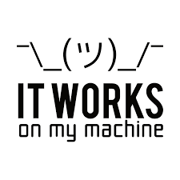

# Intro to Docker

The purpose of this lesson is to introduce you to Docker and some of the benefits that it provides.

## Vocab
- Container
- Images
- Tag

## What is Docker and Why do people use it?

Have you ever had an issue in your production environment or pulled down code only to realize it was broken. When you ask the person that pushed it up about the issue, they respond:

Docker aims to avoid these types of interactions by creating an isolated and sharable environment for code to execute in.

First let's talk about some of the benefits to this approach:

1. Packaging Environments
1. Distribution of Environments
1. Runtime
1. Scaling

How does docker create these isolated sharable environments? Docker uses what they call __containers__ to do this. A container is simply an empty execution environment and might be referred to as a sandbox. The container is "filled" when there is an __image__ to run. It could be said that a container is an instance of an image.

So, what is an image? Great question! An image is a snapshot of the config environment that has been built from the rules with in the Dockerfile.

Let's walk through Dockerizing an application together.

## Wrap Up

1. How would you define docker and it's benefits?
2. How you would use docker in your project?

__Additional Resources__
[Docker Documentation](https://docs.docker.com/)
